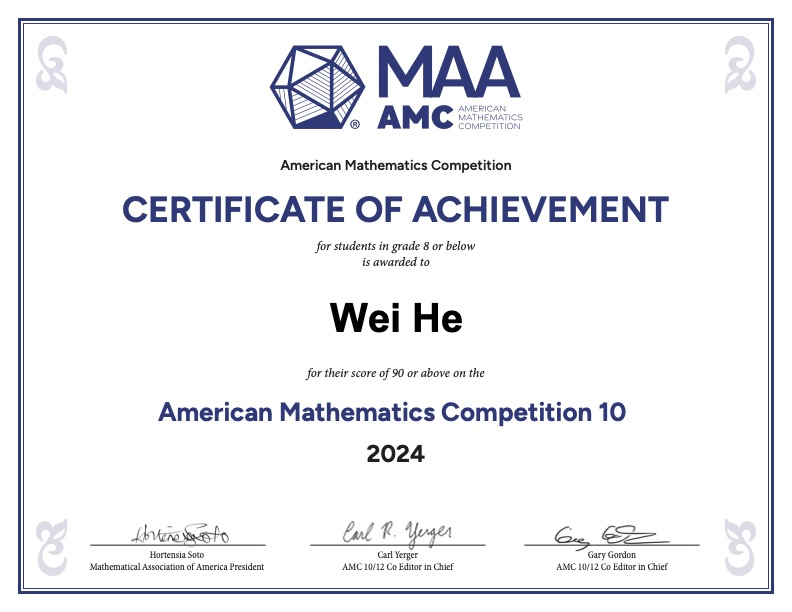
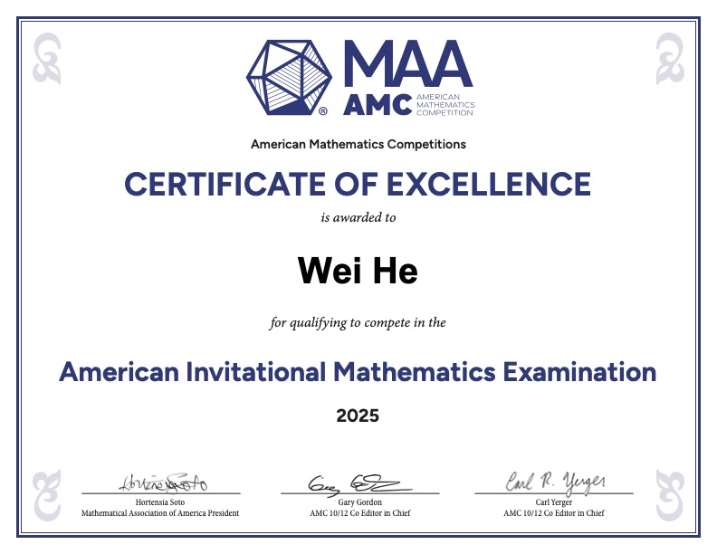
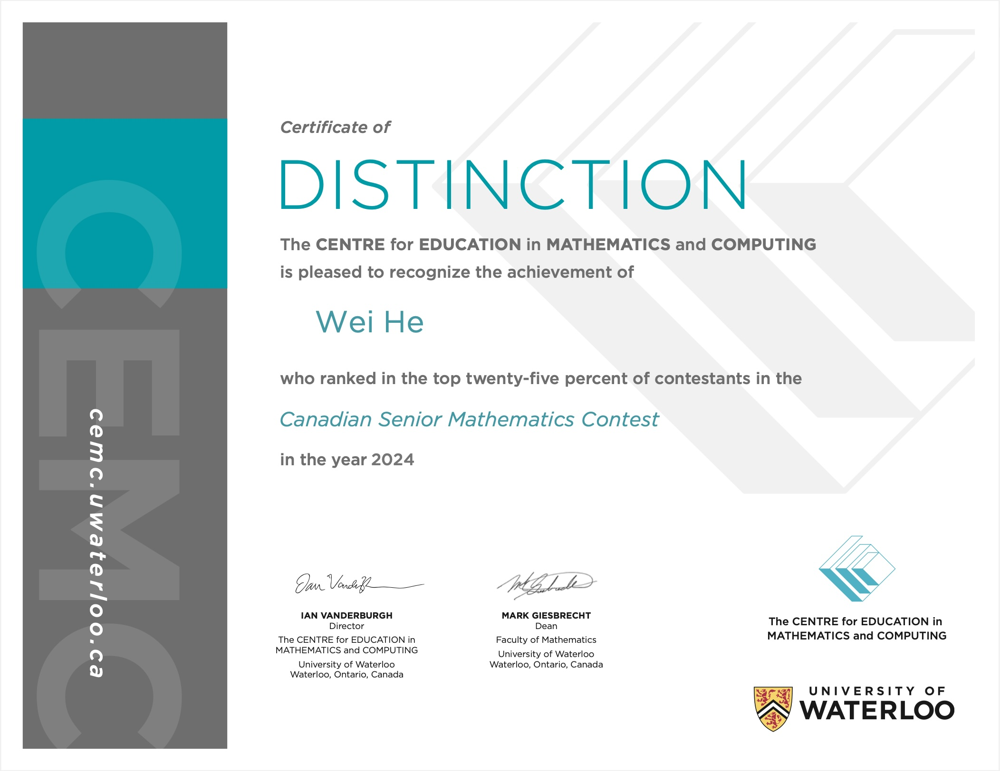
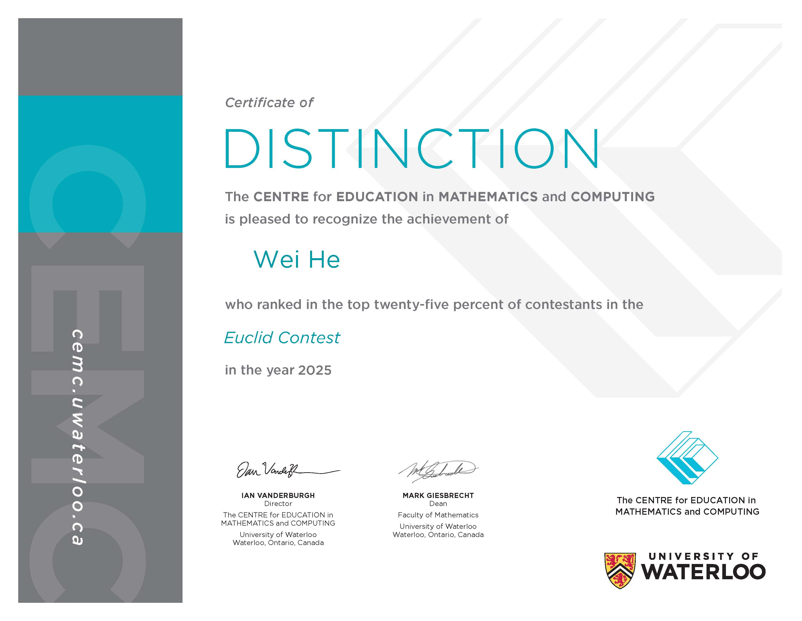
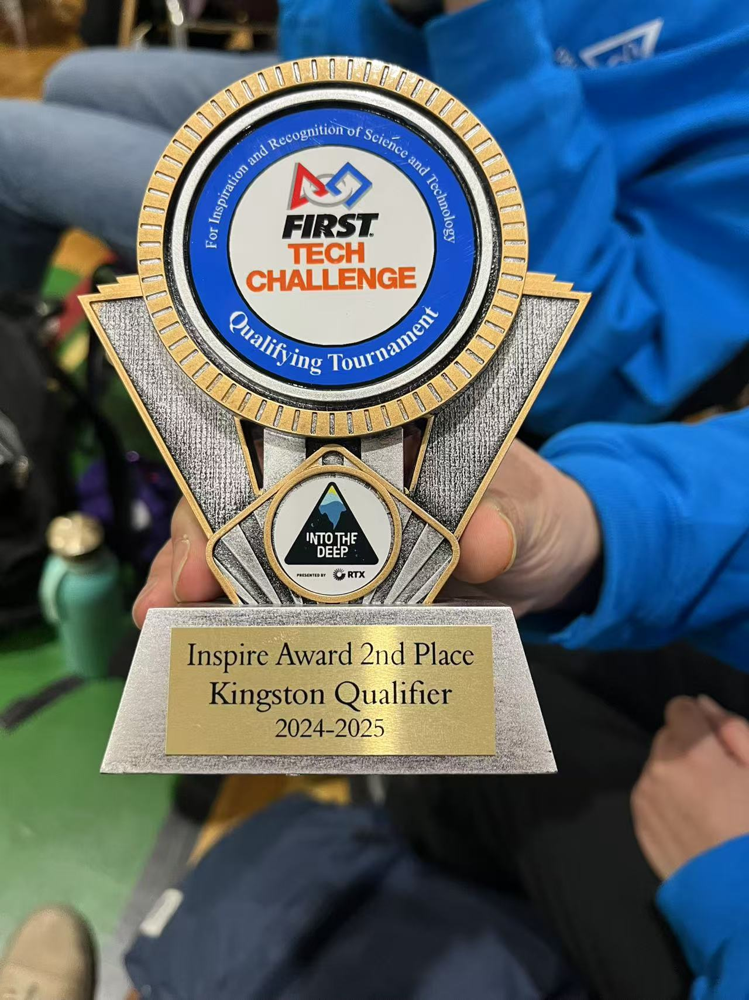
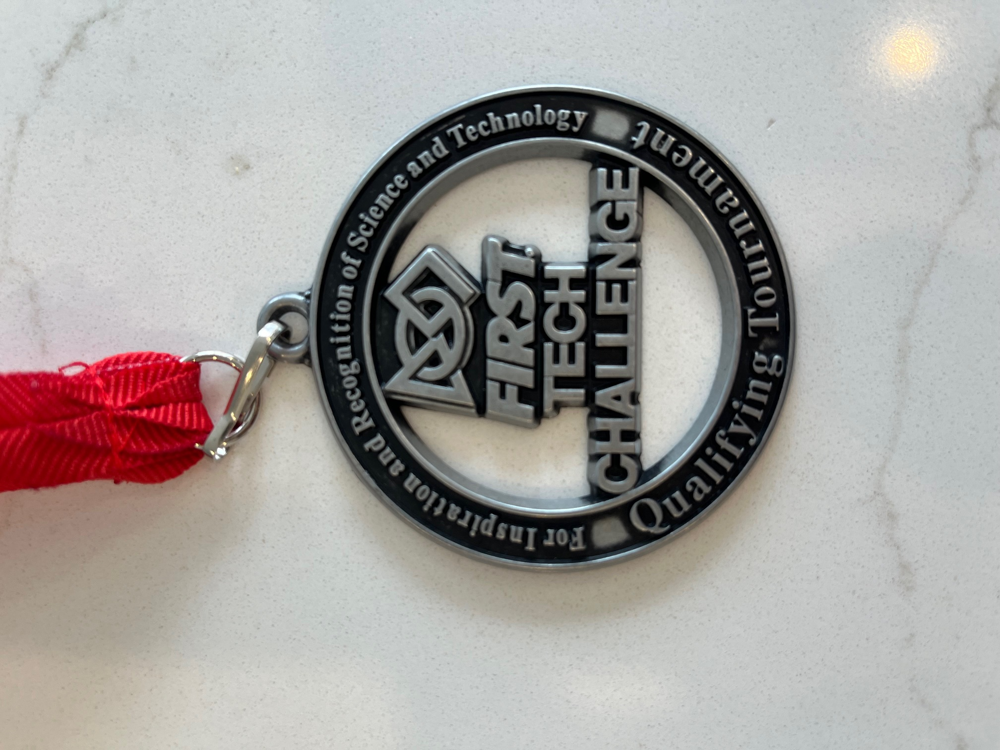

# Achievement

## Math Competition

* Received 21 out of 25 in American Mathematics Competition 8 (AMC-8) 2022, rank top 1.5% among 71143 contestants

* Received 103.5 out of 150 on the 2023 AMC 10B contest.

* Received 97.5 out of 150 on the 2024 AMC 10A contest, qualified for 2025 American Invitational Mathematics Exam (AIME).

* Received Certificate of Distinction in 2024 Canadian Senior Mathematics Contest (CSMA) with score 38 out of 60.

* Received Certificate of Distinction in 2025 Euclid Contest with score 72 out of 100.

## Computer Competition

* Received 68 out of 75 in Canadian Computing Competition (CCC) (Junior Division) 2022, rank 22nd among 4909 contestants

* Ranked top-15% among 3986 contestants in Canadian Computing Competition (CCC) (Senior Division) 2023.

* Promoted to Silver in USACO 2023 February Bronze Contest.

* Ranked Certificate of Distinction in Canadian Computing Competition (CCC) (Senior Division) 2024.

## Robotics Competition

* Our team (Team #27115 - Delta Robotics, in which my role is a Java programmer) received Inspire Award 2rd Place in FIRST Tech Challenge (FTC) Kingston Qualifier 2025, qualified for Ontario Provincial Championship. YouTube video: https://youtu.be/QFswWYzxKrY?feature=shared

* Our team (Team #27115 - Delta Robotics) received Control Award 2rd Place in FIRST Tech Challenge (FTC) North Scarbotough Qualifier 2025.

## Piano

* Received 85 out of 100 in Royal Conservatory of Music (RCM) piano level-8 practical examinantion on 2023-08-09.
