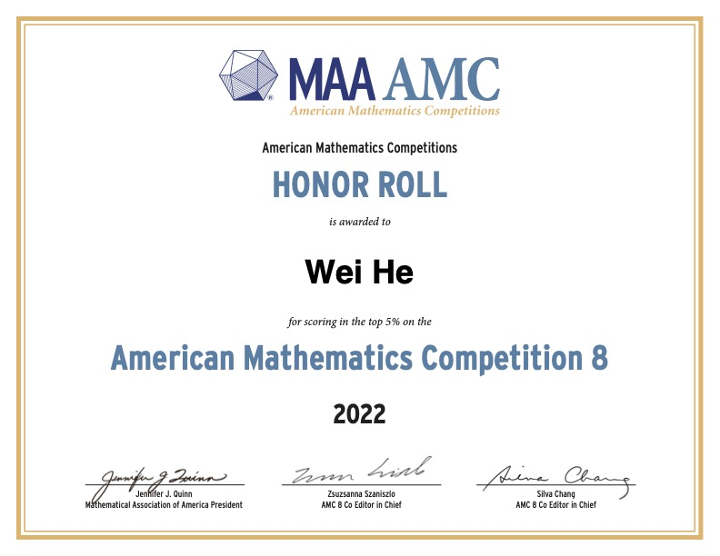
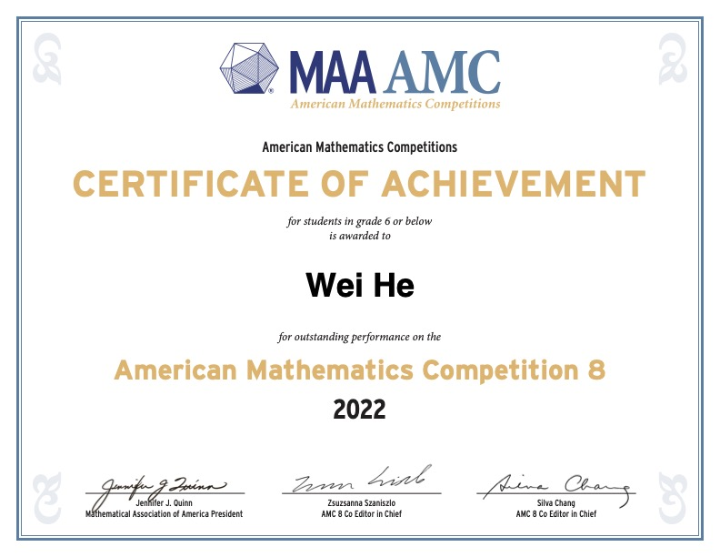
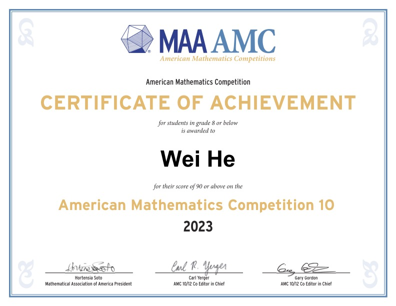
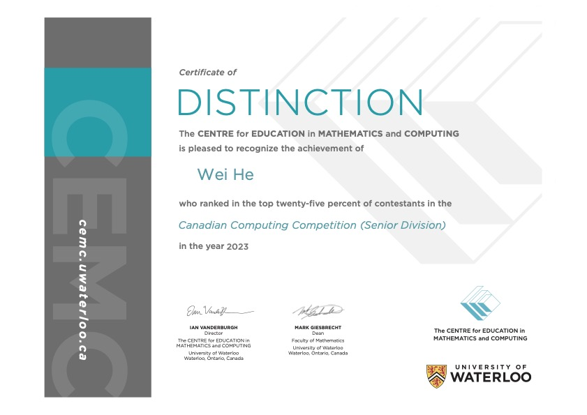
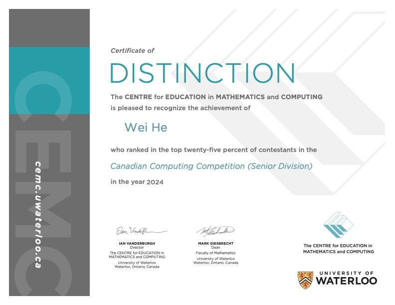

# Achievement

## Math Competition

* Received 21 out of 25 in American Mathematics Competition 8 (AMC-8) 2022, rank top 1.5% among 71143 contestants

* Received 103.5 out of 150 on the 2023 AMC 10B contest.

* Received 97.5 out of 150 on the 2024 AMC 10A contest, qualified for 2025 American Invitational Mathematics Exam (AIME).

## Computer Competition

* Received 68 out of 75 in Canadian Computing Competition (CCC) (Junior Division) 2022, rank 22nd among 4909 contestants

* Ranked top-15% among 3986 contestants in Canadian Computing Competition (CCC) (Senior Division) 2023.

* Promoted to Silver in USACO 2023 February Bronze Contest.

* Ranked Certificate of Distinction in Canadian Computing Competition (CCC) (Senior Division) 2024.

## Piano

* Received 85 out of 100 in Royal Conservatory of Music (RCM) piano level-8 practical examinantion on 2023-08-09.
